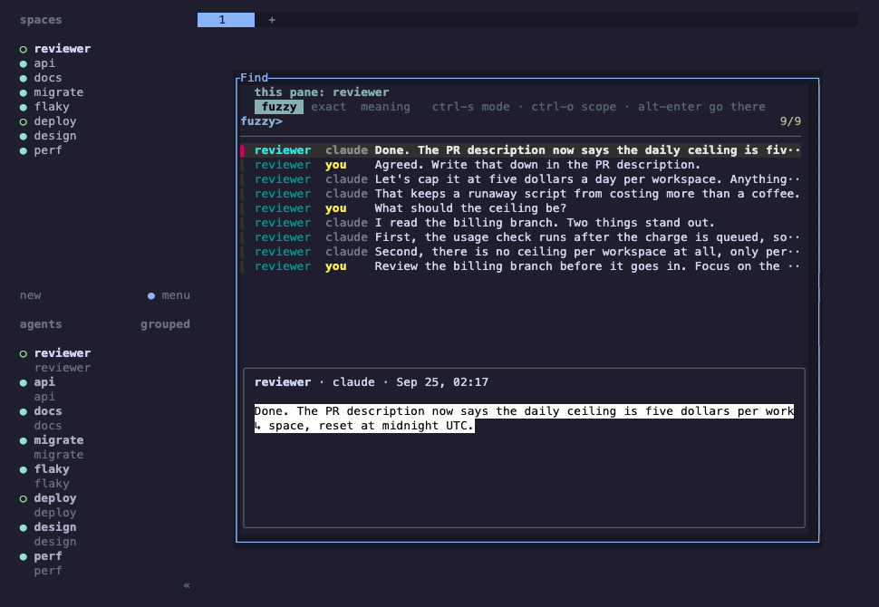
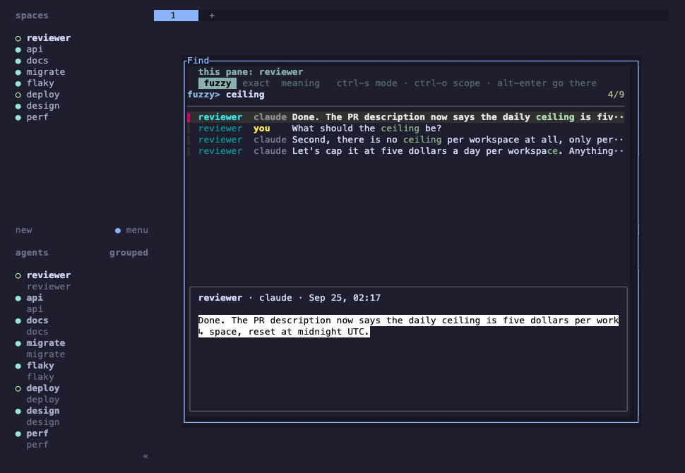
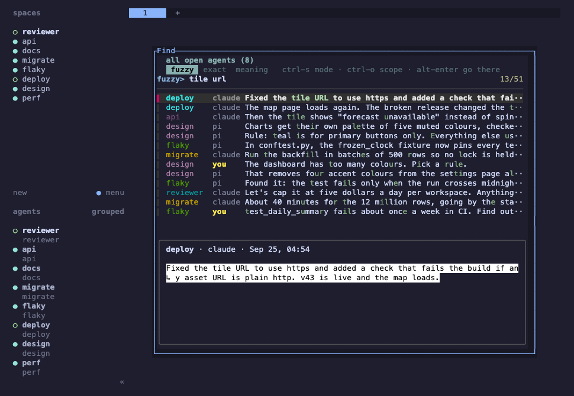
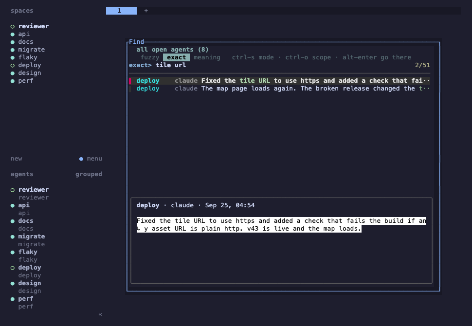
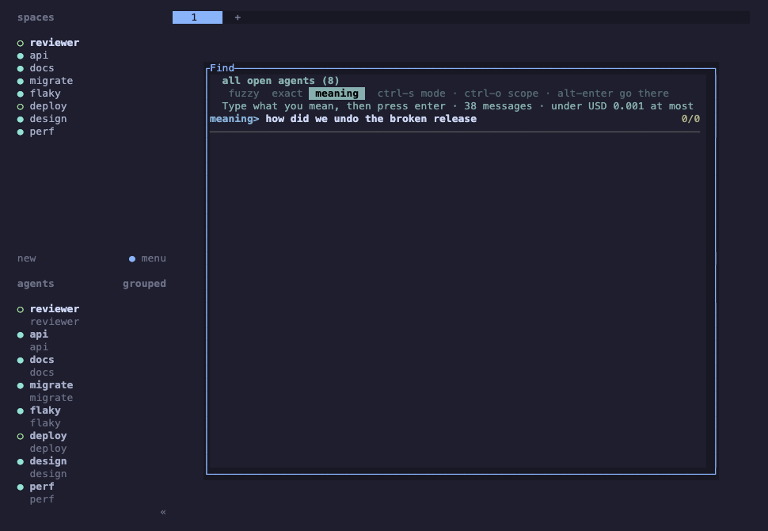
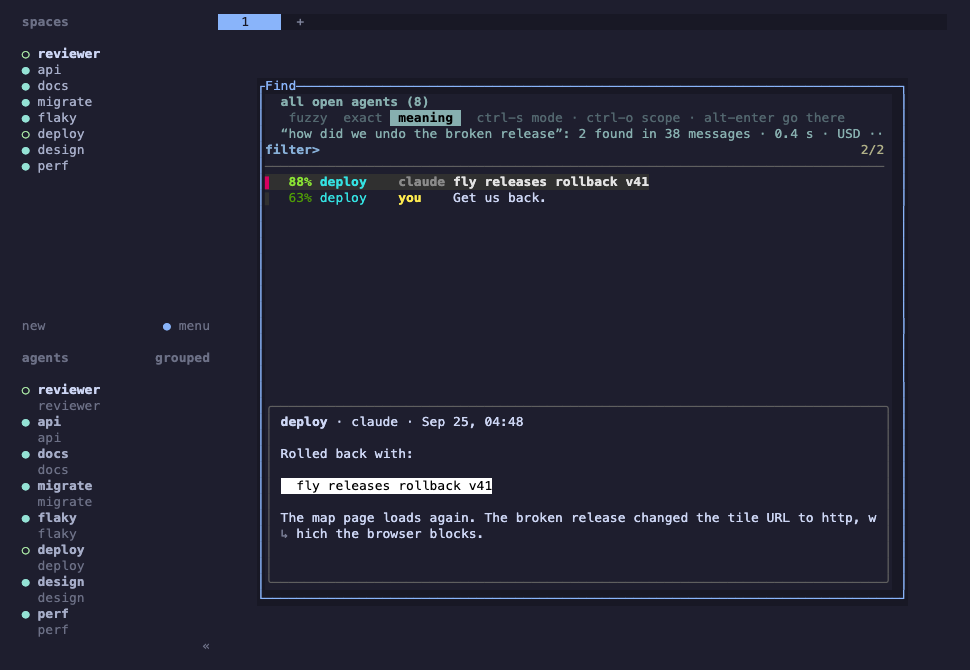
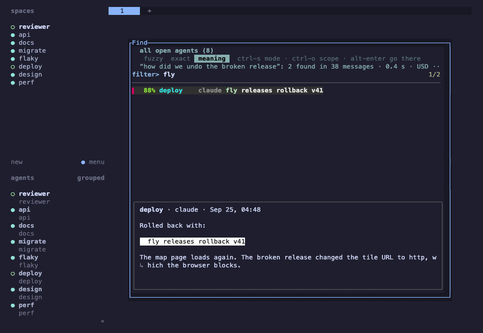
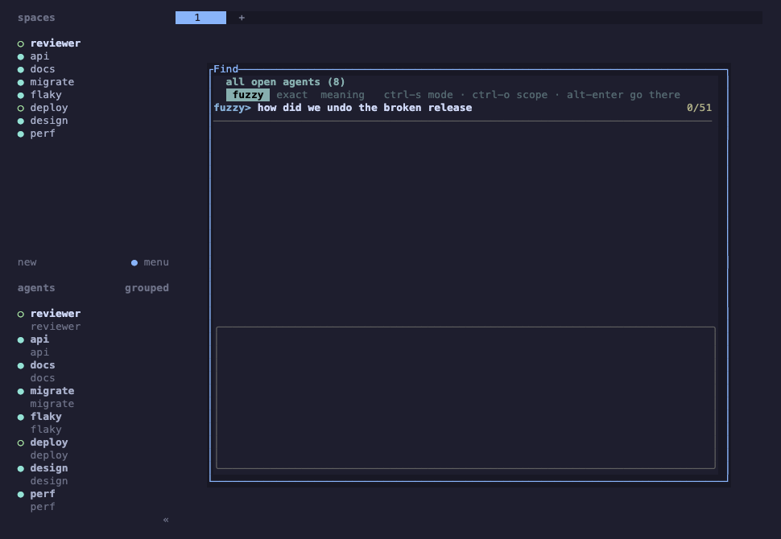
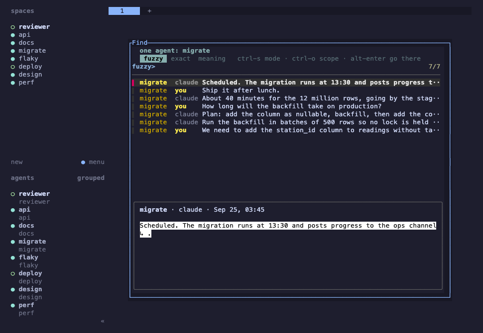
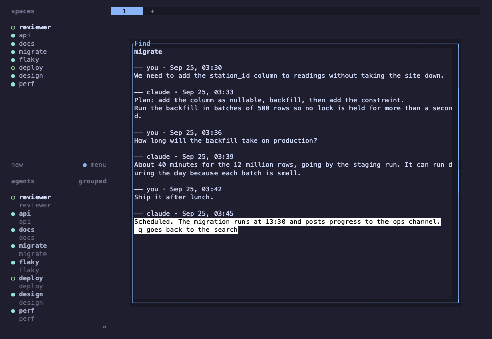

# herdr-find: searching open agents by words and by meaning

*2026-09-26T00:37:44Z by Showboat 0.6.1*
<!-- showboat-id: 8436c6e8-57cf-4582-9f72-e508687baaca -->

Every screenshot below shows the real herdr-find popup, opened with prefix+f through the plugin's own key binding, in a real herdr 0.9.0. That herdr ran as a separate throwaway server with its own HOME, attached inside an isolated lab pane, so it never touched the everyday herdr session or config. Its eight agents are made up; their conversations come from test/fixtures/build.mjs, and herdr was told which file belongs to which agent, as its Claude Code and Pi integrations do. Screens were read back from herdr with pane read --format ansi and drawn with xterm.js.

## prefix+f opens the search over the pane you are in
It starts on the reviewer agent's own conversation, fuzzy, the way fzf always works.

```bash {image}

```



```bash {image}

```



## ctrl-o: all open agents
One press widens the search to every agent open in herdr. Each agent keeps its colour, and the preview shows the whole message.

```bash {image}

```



## ctrl-s: exact
The same words, now matched exactly: the scattered fuzzy matches drop away and only the two lines with both words stay.

```bash {image}

```



## alt-m: meaning
Meaning search lists nothing and sends nothing until enter. It first shows how many messages the scope holds and the most the search could cost.

```bash {image}

```



## Meaning results replace the list
After enter, the results replace the list, best first, with how sure each match is, and the preview marks the line that answers. The question shares no words with the answer: "how did we undo the broken release" found "fly releases rollback v41". This ran against the real service: 38 messages, 0.3 s, USD 0.0005.

```bash {image}

```



Typing now narrows those results by letters, without asking again.

```bash {image}

```



## ctrl-s back to fuzzy: the words come back
Leaving meaning search puts the words back in the box and the whole scope back in the list. Fuzzy finds nothing for a whole sentence, which is why meaning search exists.

```bash {image}

```



## ctrl-o again: one agent
From all open agents, ctrl-o narrows to the agent of the line you are on (here migrate, after searching for backfill, then clearing the box).

```bash {image}

```



## enter: open in context
Enter opens the whole conversation at that line, marked; q goes back to the search.

```bash {image}

```



## alt-enter: go to the agent
alt-enter closes the search and brings the agent's workspace on screen (migrate is now the one in bold).

```bash {image}

```


## Tests
The tests use a stand-in for herdr and a loopback stand-in for the meaning service, so they need neither a herdr session nor a key.

```bash
npm test 2>&1 | grep -E '^ℹ (tests|pass|fail)'
```

```output
ℹ tests 30
ℹ pass 30
ℹ fail 0
```
