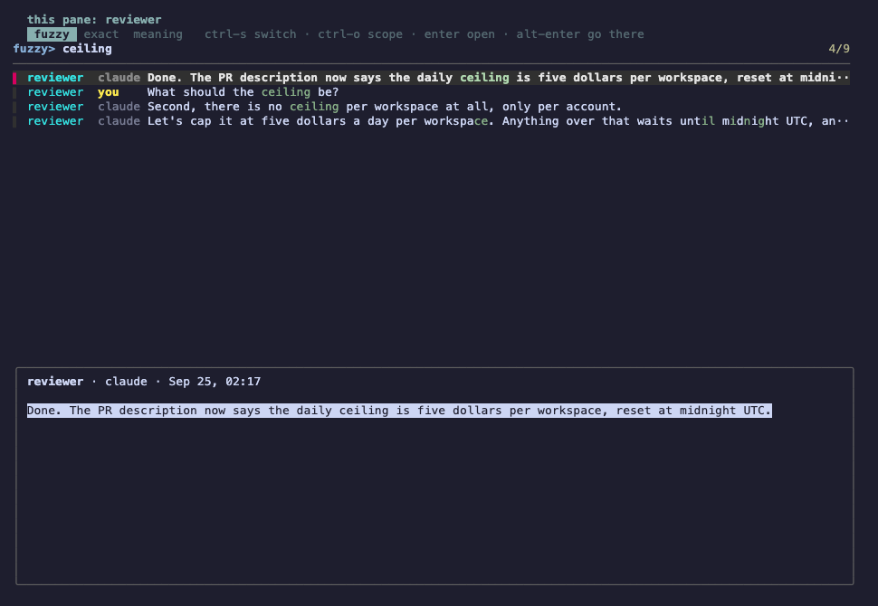
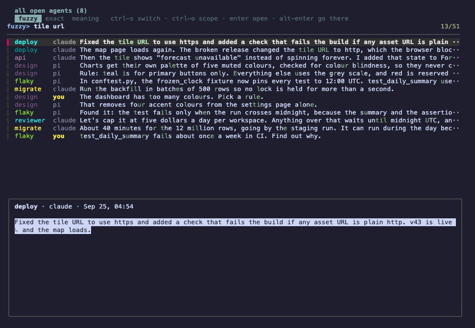
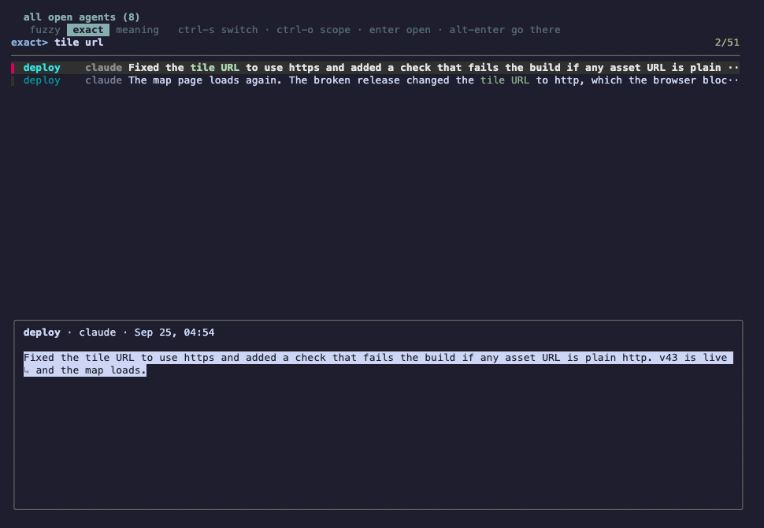
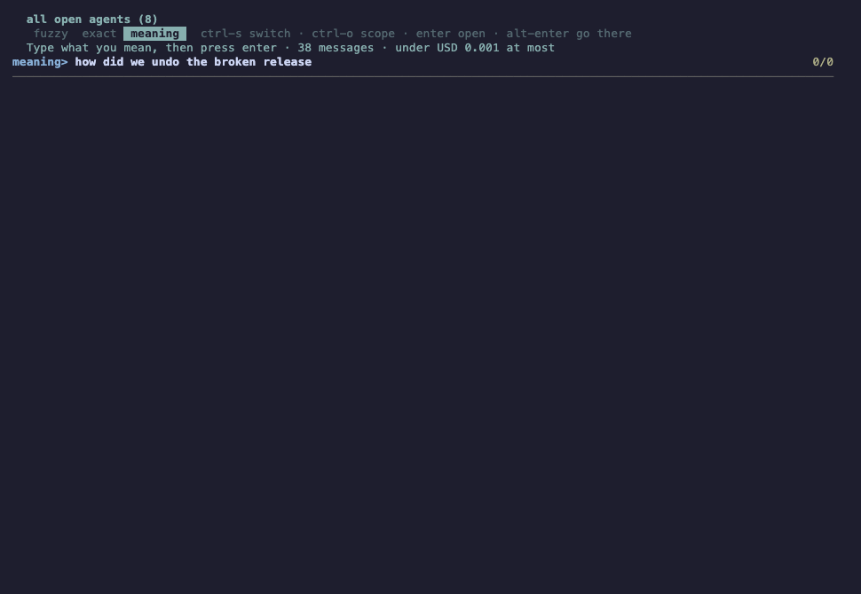
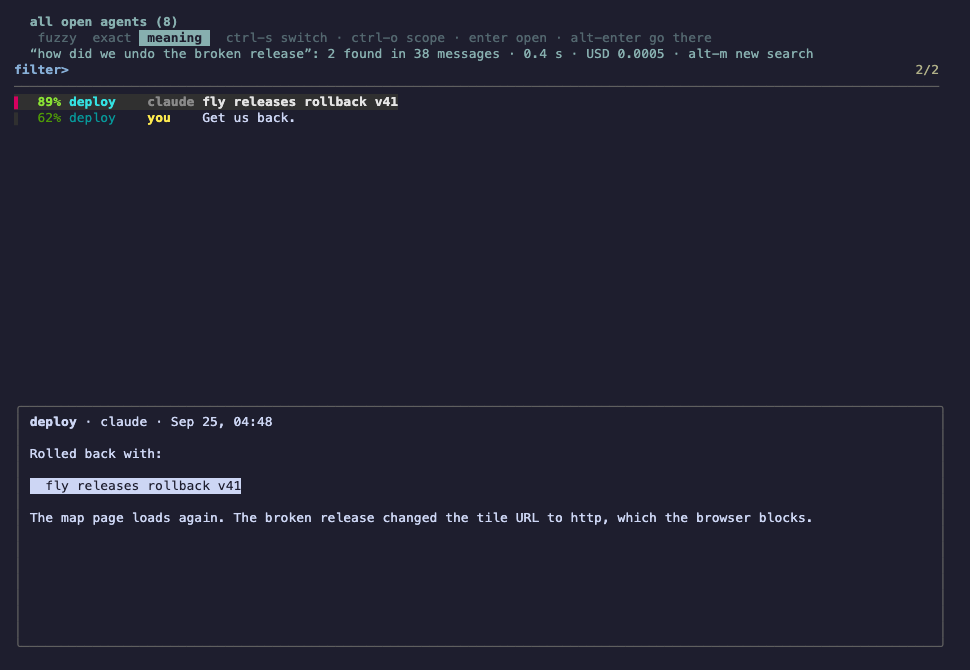
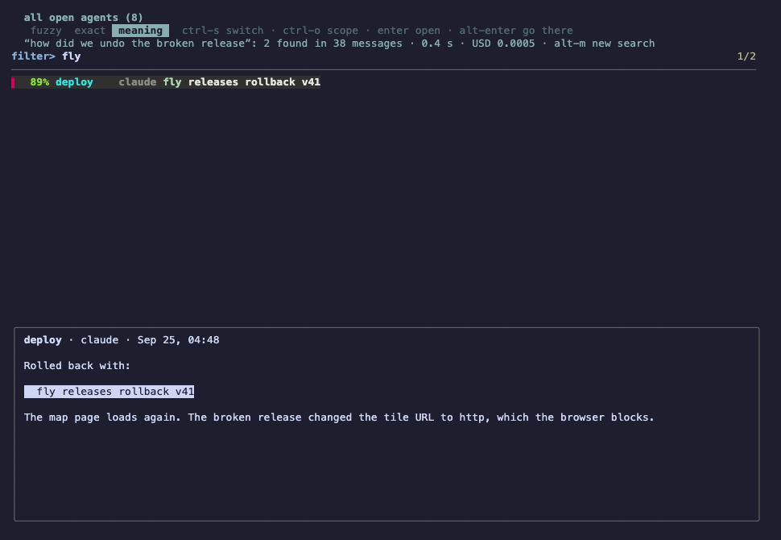
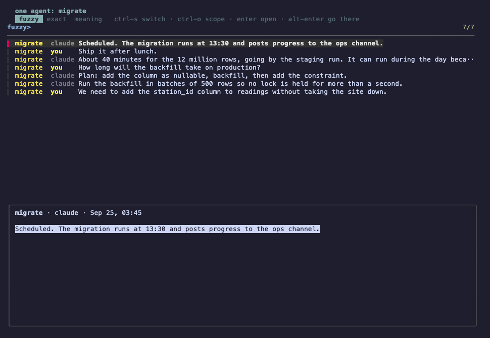
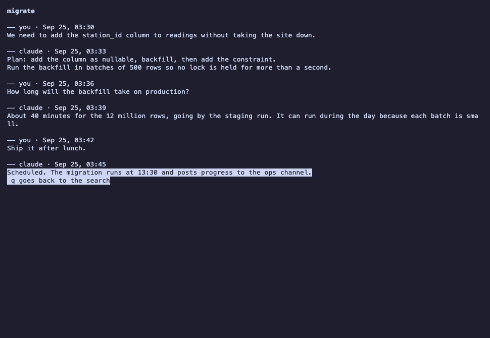

# herdr-find: searching open agents by words and by meaning

*2026-09-26T00:29:58Z by Showboat 0.6.1*
<!-- showboat-id: 7b069c08-6b24-4d33-826d-abdd9c384452 -->

Every screenshot below is the real herdr-find running in an isolated herdr session (not the everyday one), with eight made-up agents whose conversations come from test/fixtures/build.mjs. herdr reported each agent's conversation file, exactly as its Claude Code and Pi integrations do. The search ran in a herdr pane opened as if over the reviewer agent. The screen was read back from herdr with pane read --format ansi and drawn with xterm.js.

## Fuzzy search in this pane
Opened over the reviewer agent, the search starts on that agent's own conversation, fuzzy, the way fzf always works.

```bash {image}

```



## ctrl-o: all open agents
One press widens the search to every agent open in herdr. Each agent keeps its colour and the preview shows the whole message.

```bash {image}

```



## ctrl-s: exact
The same words, now matched exactly: the scattered fuzzy matches drop away and only the two lines with both words stay.

```bash {image}

```



## alt-m: meaning
Meaning search lists nothing and sends nothing until enter. It shows how many messages the scope holds and the most the search could cost first.

```bash {image}

```



## Meaning results replace the list
After enter, the results replace the list, best first, with how sure the match is. The line that answers is picked and marked in the preview. The question shares no words with the answer ("how did we undo the broken release" found "fly releases rollback v41"). This one ran against the real service: 38 messages, 0.4 s, USD 0.0005.

```bash {image}

```



Typing now narrows those results by letters, without asking again.

```bash {image}

```



## ctrl-s back to fuzzy: the words come back
Leaving meaning search puts the words back in the box and the whole scope back in the list. Fuzzy finds nothing for a whole sentence, which is why meaning search exists.

```bash {image}

```


## ctrl-o again: one agent
From all open agents, ctrl-o narrows to the agent of the line you are on (here migrate, after searching for backfill, then clearing the box).

```bash {image}

```



## enter: open in context
Enter opens the whole conversation at that line, marked; q goes back to the search. alt-enter (not pictured) focuses the agent's pane and closes the search; it was checked in the same session.

```bash {image}

```



## Tests
The tests use a stand-in for herdr and a loopback stand-in for the meaning service, so they need neither a herdr session nor a key.

```bash
npm test 2>&1 | grep -E '^ℹ (tests|pass|fail)'
```

```output
ℹ tests 29
ℹ pass 29
ℹ fail 0
```
